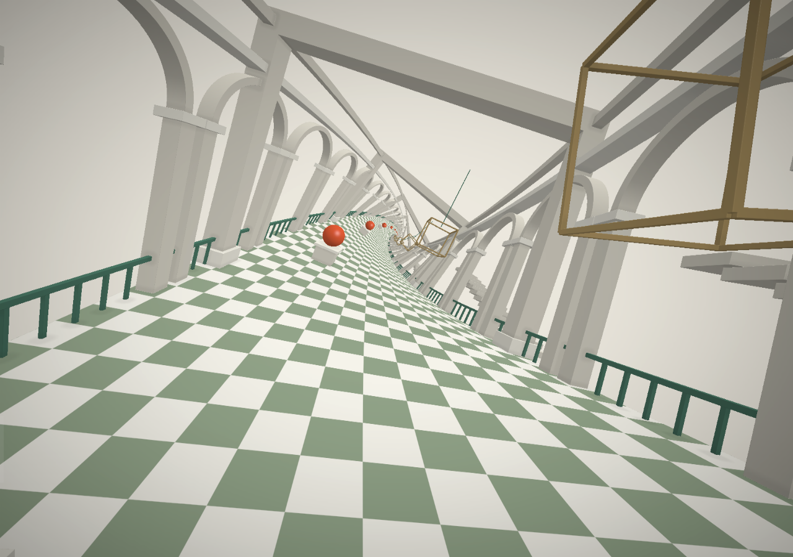
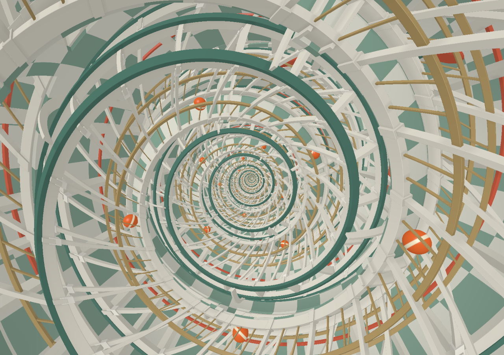

# Escher

An Escher-inspired shader playground for **Minecraft Java 26.3**. Explore repeating galleries that shrink, twist, and fold into recursive spaces, with checkerboard floors, pale stonework, green railings, and red spheres.

## Gallery

An endless arcade stretching in both directions. Each successive section becomes smaller and rotates around the corridor, drawing the architecture toward a distant vanishing point. Walk forward or backward, look around, and change the twist while exploring.



## Folding

Three connected corridors gradually fold into an infinite spiral. Watch the transformation from an overview, or enter the corridors and walk through the folded space. The scene repeats in both directions, with red balls rolling along all three corridors.

Folding and unfolding take about 18 seconds. You can also choose an intermediate shape or pause the balls.



## Build

Requires **Python 3.11+**, **GHC 9.12.2**, **Cabal**, and **Java 25**. Set `JAVA_HOME` to your Java 25 installation and run these commands from the project root. Local play is tested on Apple Silicon macOS.

Prepare the Minecraft runtime once (internet access required):

```sh
"$JAVA_HOME/bin/java" -cp harness/gradle/wrapper/gradle-wrapper.jar \
  org.gradle.wrapper.GradleWrapperMain -p harness \
  configureClientLaunch compileGametestJava compilePlayJava
```

Build both packs:

```sh
python3 scripts/build/build.py
```

The output is `build/resourcepack.zip` and `build/datapack.zip`, ready for Minecraft Java 26.3. The local launcher installs both packs and prepares its demo world on first launch.

## Explore

Start either scene in the local playground:

```sh
python3 scripts/run/play.py --scene gallery
python3 scripts/run/play.py --scene folding
```

Switch scenes in game:

```mcfunction
/function escher:scene/gallery
/function escher:scene/folding
```

| Control | Action |
| --- | --- |
| WASD + mouse | Walk and look around; mouse orbits the Folding overview |
| R | Change Gallery's twist or toggle Folding's fold/unfold animation |
| X | View the underlying collision world |
| F7 | Return to the entrance |

Use `/function escher:folding/walk` to enter the corridors and `/function escher:folding/overview` to return to the overview. Pause or resume the balls with `/function escher:folding/balls/pause` and `/function escher:folding/balls/run`.

Four quality presets are available: `low`, `balanced`, `high`, and `native`. For example:

```mcfunction
/function escher:quality/balanced
```

The resource pack renders the scenes through full-screen shaders, while the data pack provides the repeating walking space and scene controls. Buildings use procedural templates, and the spheres are visual objects. Rendering detail depends on the quality preset and GPU performance.
